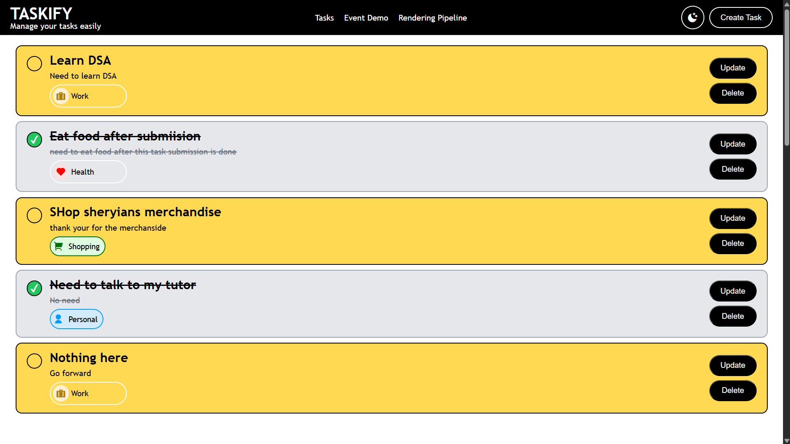
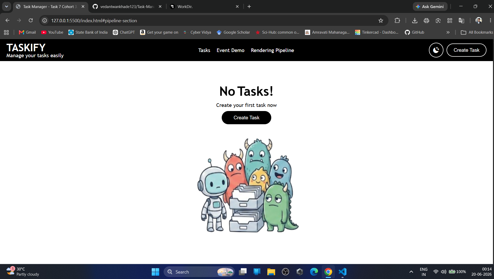
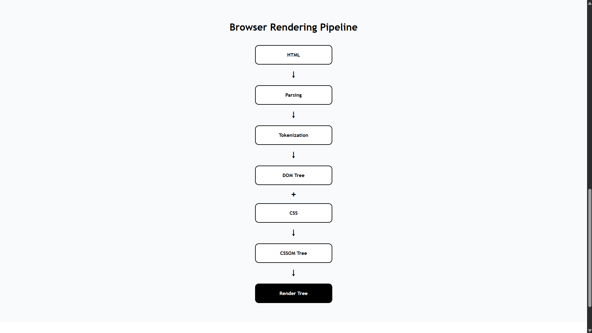
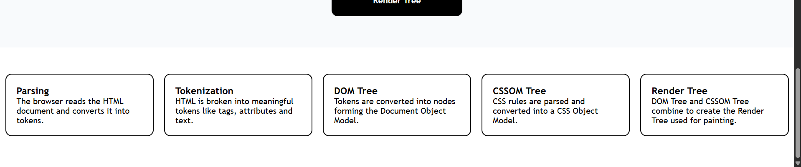
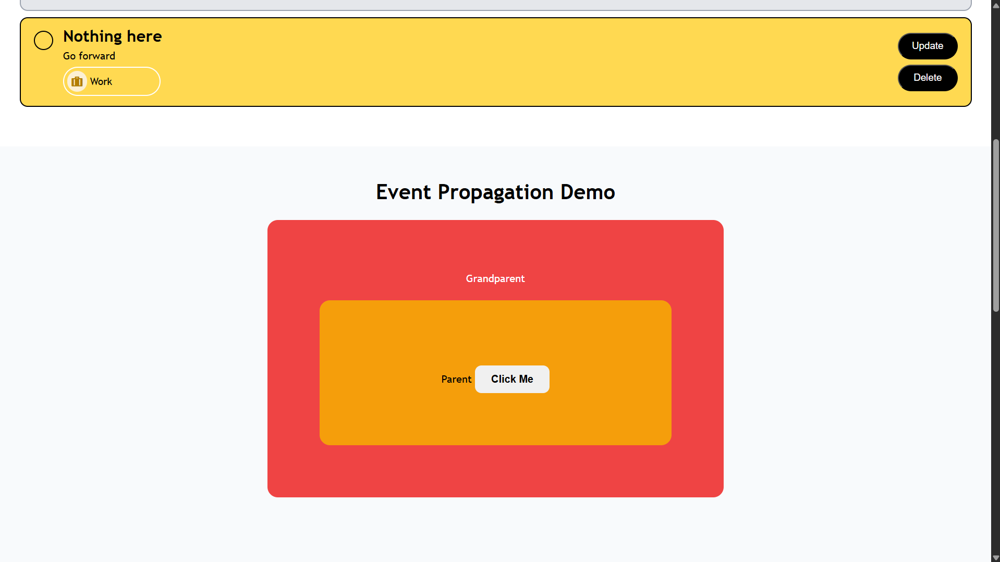

Home Page : 


Empty Home Page:


# Concepts Used in This Project

Tree Diagram(Pipeline):


## Parsing

Parsing is the process where the browser reads HTML code and understands the structure of the webpage. It analyzes tags, attributes, and content to prepare them for rendering.

Example:

```html
<h1>Hello World</h1>
```

The browser reads this code and understands that it is a heading element.

---

## Tokenization

During tokenization, the browser breaks the HTML document into smaller pieces called tokens.

Example:

```html
<h1>Hello World</h1>
```

Tokens generated:

* Opening Tag (`<h1>`)
* Text Content (`Hello World`)
* Closing Tag (`</h1>`)

These tokens are then used to build the DOM Tree.

---

## DOM Tree

The DOM (Document Object Model) Tree is a tree-like representation of all HTML elements on a webpage.

Example:

```text
Document
 └── html
      └── body
           └── h1
```

Card Flow: 


JavaScript interacts with webpage elements through the DOM Tree.

In this project, DOM methods such as `querySelector()`, `createElement()`, `append()`, and `remove()` were used to manipulate the DOM dynamically.

---

## CSSOM Tree

The CSSOM (CSS Object Model) Tree is created from CSS rules.

Just like HTML is converted into a DOM Tree, CSS is converted into a CSSOM Tree so the browser can understand styling information.

Example:

```css
h1 {
  color: blue;
}
```

The browser converts these styles into CSSOM nodes.

---

## Render Tree

The Render Tree is formed by combining:

* DOM Tree
* CSSOM Tree

The Render Tree contains only visible elements and is used by the browser to paint content on the screen.

Flow:

```text
HTML
↓
Parsing
↓
Tokenization
↓
DOM Tree

CSS
↓
CSSOM Tree

DOM Tree + CSSOM Tree
↓
Render Tree
```

---

## Event Bubbling

Event Bubbling is the default behavior where an event starts from the target element and moves upward through its ancestors.

Example order:

```text
Child
↓
Parent
↓
Grandparent
```

In this project, Event Bubbling was demonstrated using nested elements and console logs.

---

## Event Capturing

Event Capturing is the opposite of Event Bubbling. The event starts from the outermost ancestor and moves toward the target element.

Example order:

```text
Grandparent
↓
Parent
↓
Child
```

This behavior was demonstrated using the third parameter of `addEventListener()` set to `true`.

---

## Event Delegation

Event Delegation is a technique where a single event listener is attached to a parent element instead of attaching separate listeners to multiple child elements.

Benefits:

* Better performance
* Less memory usage
* Handles dynamically created elements automatically

In this project, Event Delegation is used for dynamically generated task cards to handle actions such as:

* Complete Task
* Update Task
* Delete Task

using a single click listener and checking `event.target`.

Event Propagation: 



## Difference Between `input.value` and `input.getAttribute("value")`

In JavaScript, HTML attributes and DOM properties are related but not the same.

### `input.value`

The `value` property returns the **current value** of the input field.

Example:

```javascript
const input = document.querySelector("input");
console.log(input.value);
```

If the user types something into the input box, `input.value` will return the updated value entered by the user.

---

### `input.getAttribute("value")`

The `getAttribute("value")` method returns the **original value written in the HTML attribute**.

Example:

```javascript
const input = document.querySelector("input");
console.log(input.getAttribute("value"));
```

This value does not automatically change when the user types into the input field.

---

### Example

HTML:

```html
<input type="text" value="Vedant">
```

JavaScript:

```javascript
console.log(input.value);
console.log(input.getAttribute("value"));
```

Initial Output:

```text
Vedant
Vedant
```

After changing the input to:

```text
Vedant Wankhade
```

Output becomes:

```text
input.value                 → Vedant Wankhade
input.getAttribute("value") → Vedant
```

### Conclusion

* `input.value` → Current value of the input field (Property)
* `input.getAttribute("value")` → Original value written in HTML (Attribute)

This demonstrates the difference between DOM Properties and HTML Attributes.

